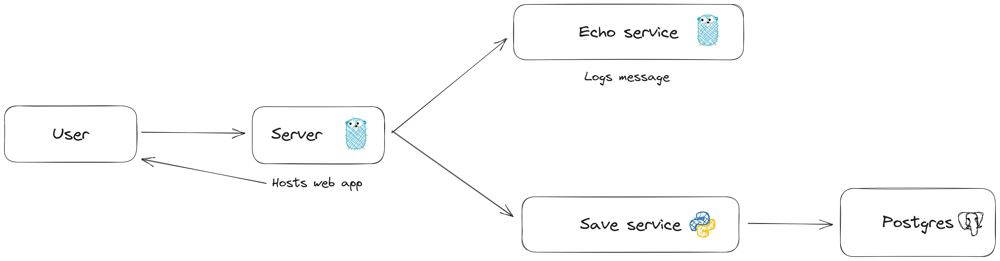

# Description
A small microservice app. A user sends a message to the server and it is passed through Redis streams to 2 small services,
one made with Go, that echoes messages, and a second made in Python that saves them to Postgres database.

